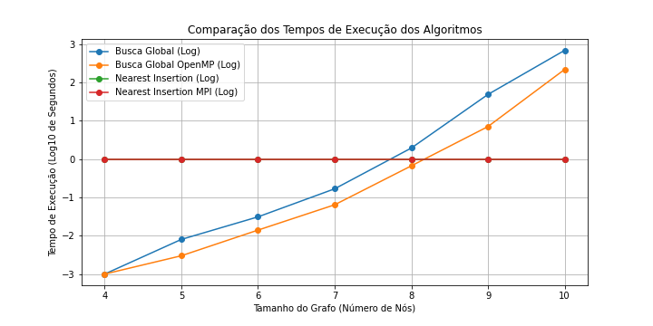
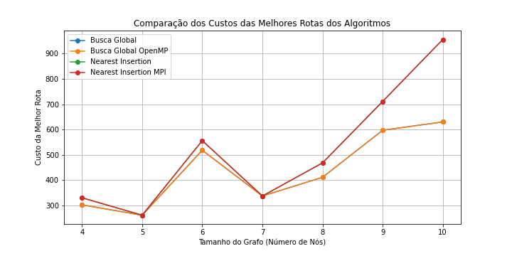

# Projeto SuperComputação 2024.1: Otimização de Rotas de Veículos (Vehicle Routing Problem - VRP)

## Introdução

O problema de Otimização de Rotas de Veículos (VRP) é um desafio de otimização comum em planejamento logístico e transporte. O objetivo é projetar as rotas mais eficientes para uma frota de veículos que entregam produtos ou serviços a uma série de destinos, atendendo a restrições específicas. Essas restrições geralmente incluem a capacidade dos veículos, a distância máxima de viagem ou o número de paradas por rota. Soluções eficazes para o VRP são essenciais para reduzir custos operacionais e melhorar a eficiência logística.

## Implementações

### 1. Busca Global (`buscaglobal.cpp`)

**Estratégia:**
A implementação de busca global gera e avalia exaustivamente todas as permutações de rotas para determinar as rotas mais eficazes que atendem a restrições específicas, como peso máximo e número de paradas.

**Lógica:**
- **Simulação de Rotas:** Cada permutação é simulada como uma rota potencial de entrega. A simulação itera por cada permutação, verificando cada etapa para ver se adicionar a próxima parada excederia a capacidade do veículo ou violaria outras restrições.
- **Violação e Correção de Restrições:** Se uma restrição for violada, o algoritmo tenta corrigir a rota inserindo uma viagem de retorno ao depósito ('0'). Essa ação redefine a carga do veículo, permitindo a continuação da rota sem violar as restrições.
- **Validação de Rotas:** Se não for viável retornar ao depósito ou continuar do depósito até a próxima parada (devido à falta de rotas diretas), a rota é considerada inválida e descartada.

**Vantagens:**
- Garante a solução ótima ao considerar todas as rotas possíveis.

**Desvantagens:**
- Altamente exigente computacionalmente e impraticável para grandes instâncias devido ao crescimento exponencial das permutações.

### 2. Busca Global Paralelizada com OpenMP (`bg_parallel_OMP.cpp`)

**Estratégia:**
Esta implementação melhora a busca global básica incorporando processamento paralelo usando OpenMP, o que melhora a eficiência e reduz o tempo de execução.

**Lógica:**
- **Processamento Paralelo:** A carga de trabalho de avaliação das permutações de rotas é distribuída entre vários threads, permitindo o processamento simultâneo.
- **Avaliação e Correção de Rotas:** Similar à abordagem de um único thread, cada thread avalia um subconjunto de rotas, verificando e corrigindo violações de restrições, inserindo retornos ao depósito quando necessário.
- **Sincronização:** O acesso a recursos compartilhados, como a lista de rotas válidas, é sincronizado entre os threads para evitar corrupção de dados e garantir resultados precisos.

**Vantagens:**
- Acelera significativamente o processo de avaliação, aproveitando processadores multicore.

**Desvantagens:**
- A escalabilidade ainda pode ser um desafio com conjuntos de dados muito grandes devido à complexidade inerente de explorar todas as combinações possíveis de rotas.

### 3. Solução Aproximada com Nearest Insertion (`n_insertion.cpp`)

**Estratégia:**
A implementação de busca local utiliza a heurística de "inserção mais próxima" para construir uma rota. Este método é menos intensivo computacionalmente em comparação com a busca global e foca em construir uma rota viável incrementalmente.

**Lógica:**
- **Inicialização:** Começa do depósito (representado como 0), que é o ponto de partida e chegada da rota.
- **Construção da Rota:**
  - A partir da parada atual, a próxima parada é selecionada com base na rota mais curta disponível que não viole a restrição de capacidade.
  - Esse processo de seleção continua até que não possam ser adicionadas mais paradas sem violar as restrições.
- **Tratamento de Violações:**
  - Se adicionar a próxima parada exceder a capacidade do veículo, a rota é modificada retornando ao depósito para descarregar (inserindo 0 na rota) e, em seguida, continuando.
  - O processo calcula o custo da rota, levando em conta todos os desvios de retorno ao depósito.
- **Terminação:** A rota termina quando todas as paradas foram visitadas ou não restam movimentos válidos. O veículo retorna ao depósito.

**Vantagens:**
- Rápido e eficiente para instâncias maiores.
- Gera soluções boas em tempo razoável, útil para aplicações práticas onde uma solução ótima não é viável.

**Desvantagens:**
- Não garante a solução ótima, mas frequentemente encontra soluções de alta qualidade.

### 4. Solução Aproximada Paralelizada com MPI (`n_insertion_MPI.cpp`)

**Estratégia:**
Esta versão paraleliza a heurística de Nearest Insertion utilizando MPI para distribuir o processamento entre múltiplos nós em um cluster, melhorando o desempenho em sistemas distribuídos.

**Lógica:**
- **Computação Distribuída:** As permutações de rotas são divididas e distribuídas entre diferentes nós usando MPI, compartilhando efetivamente a carga computacional.
- **Avaliação Paralela de Rotas:** Dentro de cada nó, o OpenMP é usado para paralelizar ainda mais o processamento de cada subconjunto de permutações.
- **Correção e Validação de Rotas:** Cada thread examina a validade da rota, tentando corrigir violações inserindo retornos ao depósito quando necessário. Rotas que não podem ser corrigidas são descartadas.
- **Compilação de Resultados:** Após o processamento, os resultados de todos os nós são coletados e a rota mais econômica é identificada e selecionada no nó raiz.

**Vantagens:**
- Permite o processamento de grandes instâncias em um cluster, aproveitando a capacidade de múltiplas máquinas.
- Melhora significativamente o tempo de execução em ambientes distribuídos.

**Desvantagens:**
- A comunicação entre os processos MPI pode introduzir overhead, mas é compensada pelo ganho de desempenho na paralelização.

## Análise de Desempenho

Os códigos foram testados com os mesmos arquivos de entrada, variando de grafos com 4 até 10 nós. Os resultados mostraram que:

- **Busca Global:**
  - Produz a solução ótima, mas o tempo de execução cresce exponencialmente com o aumento do tamanho do grafo.
  - Exemplo de saída:
    ```
    Solucao para: ../grafos/grafo_4.txt
    Sequencia de locais na melhor rota: 0 -> 1 -> 0 -> 2 -> 4 -> 0 -> 3 -> 0 -> 0
    Custo da melhor rota: 302
    Tempo de exec: 1 milissegundos (0.001 segundos).
    ```

- **Busca Global com OpenMP:**
  - Aumenta a eficiência em comparação com a busca global simples, mas ainda apresenta crescimento exponencial do tempo de execução.
  - Exemplo de saída:
    ```
    Solucao para: ../grafos/grafo_4.txt
    Sequencia de locais na melhor rota: 0 -> 3 -> 0 -> 1 -> 0 -> 2 -> 4 -> 0 -> 0
    Custo da melhor rota: 302
    Tempo de exec: 1 milissegundos (0.001 segundos).
    ```

- **Solução Aproximada com Nearest Insertion:**
  - Oferece soluções rápidas e boas, mas não garante a solução ótima.
  - Exemplo de saída:
    ```
    Solucao para: ../grafos/grafo_4.txt
    Sequencia de locais na melhor rota: 0 -> 3 -> 4 -> 0 -> 2 -> 0 -> 1 -> 0 -> 0
    Custo da melhor rota: 330
    Tempo de exec: 0 milissegundos (0.000 segundos).
    ```

- **Solução Aproximada com MPI:**
  - Melhora o desempenho em sistemas distribuídos, mantendo a qualidade da solução.
  - Exemplo de saída:
    ```
    Processo 0 - Solucao para: grafo_4.txt
    Sequencia de locais na melhor rota: 0 -> 3 -> 4 -> 0 -> 2 -> 0 -> 1 -> 0 -> 0
    Custo da melhor rota: 330
    Tempo de exec: 0 milissegundos (0.000 segundos).
    ```

Os gráficos a seguir comparam o tempo de execução e o custo das melhores rotas para cada algoritmo testado.




- Comparação dos Tempos de Execução dos Algoritmos: Exibe o tempo de execução em escala logarítmica para cada algoritmo, permitindo visualizar melhor as diferenças de desempenho.
- Comparação dos Custos das Melhores Rotas dos Algoritmos: Mostra o custo das melhores rotas encontradas por cada algoritmo, facilitando a comparação da qualidade das soluções.
## Instruções de Uso

### Compilação:

```sh
g++ -o buscaglobal buscaglobal.cpp
g++ -fopenmp -o bg_parallel_OMP bg_parallel_OMP.cpp
g++ -o n_insertion n_insertion.cpp
mpic++ -o n_insertion_MPI n_insertion_MPI.cpp
